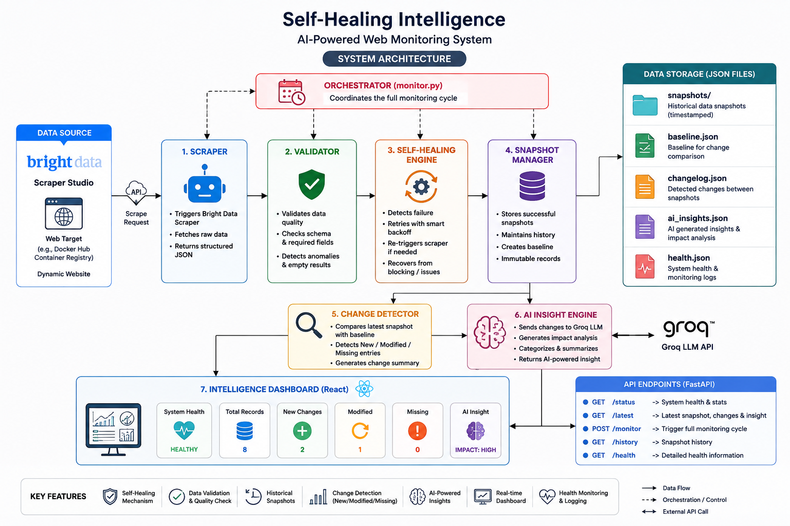
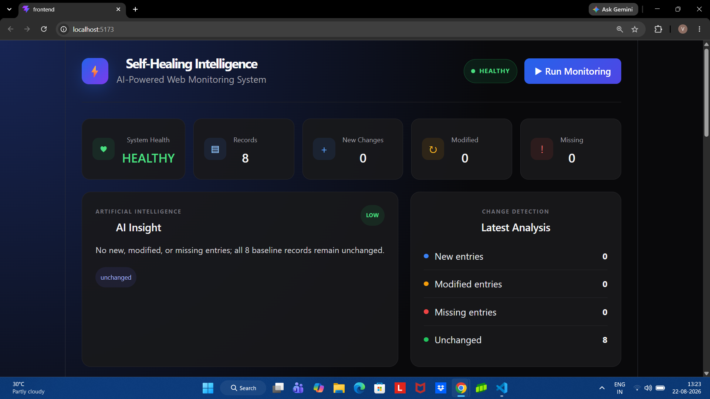
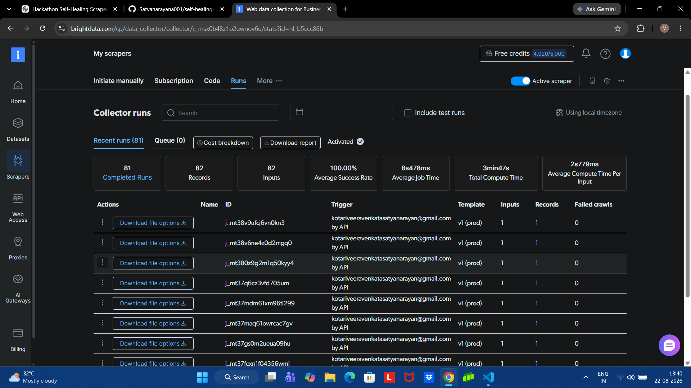
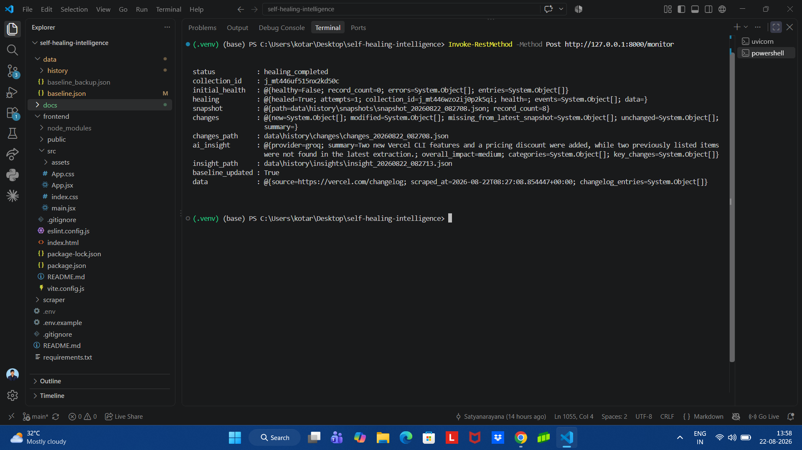

# 🧠 Self-Healing Web Intelligence

> An AI-powered web monitoring system that detects website changes, validates scraped data, automatically recovers from extraction failures, and generates intelligent insights.

Built for the **Into the Scrape-Verse Hackathon**.

---

## 🚀 Overview

**Self-Healing Web Intelligence** is an automated web monitoring platform that tracks changes on a website and maintains a historical record of its content.

Unlike a traditional scraper that simply extracts data and stops, this system follows an intelligent monitoring pipeline:

1. Extract website data using **Bright Data Scraper Studio**
2. Validate the extracted data
3. Detect unhealthy or failed scraper results
4. Automatically trigger a **self-healing recovery process**
5. Create timestamped snapshots
6. Compare the latest snapshot with the previous baseline
7. Detect new, modified, missing, and unchanged records
8. Generate AI-powered insights using **Groq**
9. Store monitoring history
10. Display the latest system state through a **React dashboard**

The current implementation monitors the **Vercel Changelog**:

```text
https://vercel.com/changelog
```

---

# 📸 Project Screenshots

## 🏗️ System Architecture

The architecture below shows the complete monitoring pipeline, including Bright Data Scraper Studio, health validation, self-healing recovery, snapshot creation, change detection, Groq AI analysis, and the React dashboard.



---

## 📊 Monitoring Dashboard

The React dashboard provides a visual overview of the latest monitoring cycle.

It displays:

- System health
- Total records extracted
- New changes
- Modified entries
- Missing entries
- AI-generated insights
- Change detection results



---

## 🌐 Bright Data Scraper Execution

The project uses a custom scraper created in **Bright Data Scraper Studio** to extract structured changelog information.

The Bright Data integration is responsible for triggering scraper collections, retrieving collection results, and providing the structured data used by the monitoring pipeline.



---

## ❤️‍🩹 Self-Healing Demonstration

The system detects an unhealthy extraction, automatically triggers a new Bright Data collection, validates the recovered data, and continues the monitoring pipeline.

A successful recovery can produce a result such as:

```text
status: healing_completed

initial_health:
  healthy: false
  record_count: 0

healing:
  healed: true
  attempts: 1

snapshot:
  record_count: 8

baseline_updated: true
```



---

# ✨ Features

## 🔎 Automated Web Monitoring

The system automatically extracts structured changelog information from the monitored website.

Each changelog entry contains:

- Title
- Description
- URL

Example:

```json
{
  "title": "Example Changelog Update",
  "description": "Description of the update.",
  "url": "https://example.com/changelog/update"
}
```

---

## ❤️ Data Health Validation

Scraped data is validated before it enters the monitoring pipeline.

The validation process checks:

- Whether scraper data exists
- Number of extracted records
- Whether records have the expected structure
- Whether required fields are present
- Whether entries contain invalid or empty values

If the extracted data does not meet the expected requirements, it is marked as **unhealthy**.

```text
Scraper Data
     │
     ▼
Data Validation
     │
 ┌───┴────┐
 │        │
Healthy  Unhealthy
 │        │
 ▼        ▼
Continue Self-Healing
```

---

# 🔄 Self-Healing System

One of the main features of this project is the ability to recover from scraper failures.

If Bright Data returns:

- Empty data
- Invalid data
- Missing expected records
- Unhealthy extraction results

the system automatically starts the self-healing process.

The recovery workflow:

```text
Extraction Failure
        │
        ▼
Health Validation
        │
        ▼
Data Marked Unhealthy
        │
        ▼
Trigger New Bright Data Collection
        │
        ▼
Wait for Dataset
        │
        ▼
Retrieve New Results
        │
        ▼
Validate Again
        │
   ┌──────┴──────┐
   │             │
Healthy      Still Unhealthy
   │             │
   ▼             ▼
Continue      Retry Recovery
Pipeline
```

The monitoring cycle can return statuses such as:

| Status | Meaning |
|---|---|
| `healthy` | Initial scraper result was valid |
| `healing_completed` | Initial extraction failed but recovery succeeded |
| `healing_failed` | Recovery attempts were unsuccessful |

Example:

```json
{
  "status": "healing_completed",
  "healed": true,
  "attempts": 1
}
```

---

# 📸 Snapshot System

Every successful monitoring cycle creates a timestamped snapshot of the extracted website data.

Snapshots are stored in:

```text
data/history/snapshots/
```

Example:

```text
snapshot_20260822_082708.json
```

A snapshot represents the normalized state of the monitored website at a specific point in time.

Example structure:

```json
{
  "source": "https://vercel.com/changelog",
  "scraped_at": "2026-08-22T08:27:08.854447+00:00",
  "changelog_entries": [
    {
      "title": "Example Update",
      "description": "Example description",
      "url": "https://example.com"
    }
  ]
}
```

---

# 🔁 Baseline Management

The system maintains a **baseline**, representing the previously validated state of the monitored website.

The baseline is stored in:

```text
data/baseline.json
```

Only successfully validated snapshots are allowed to replace the baseline.

This prevents situations such as:

```text
Scraper Failure
      ↓
Empty Data
      ↓
Baseline Accidentally Replaced
```

Instead:

```text
Empty or Invalid Snapshot
          │
          ▼
Baseline Update Blocked
```

The baseline is updated only after the monitoring pipeline successfully completes.

---

# 🔍 Change Detection

The latest snapshot is compared with the previous baseline.

The system detects four types of changes:

### 🆕 New

A new changelog entry exists in the latest snapshot but was not present in the baseline.

### ✏️ Modified

An existing entry changed.

For example:

```text
Old:
Deployment Storage keeps your deployments rollback-ready

New:
Deployment Storage keeps your deployments rollback-ready TEST
```

### ❌ Missing

An entry that existed in the previous baseline is not present in the latest snapshot.

### ✅ Unchanged

An entry remains the same between the baseline and the latest snapshot.

Example summary:

```json
{
  "new": 0,
  "modified": 1,
  "missing_from_latest_snapshot": 0,
  "unchanged": 7
}
```

---

# 🤖 AI-Powered Change Analysis

After detecting changes, the system sends the change information to an AI analyzer.

The current implementation uses **Groq** for AI-powered analysis.

The AI generates:

- A human-readable summary
- Overall impact
- Change categories
- Important detected changes

Example:

```text
One title was updated in the latest snapshot.

Overall Impact: low
```

Another example:

```text
No new, modified, or missing entries detected.

Overall Impact: low
```

AI insights are stored in:

```text
data/history/insights/
```

---

# 🏗️ System Architecture

```text
                    Vercel Changelog
                           │
                           ▼
                Bright Data Scraper Studio
                           │
                           ▼
                    Data Extraction
                           │
                           ▼
                   Health Validation
                           │
              ┌────────────┴────────────┐
              │                         │
              ▼                         ▼
           HEALTHY                  UNHEALTHY
              │                         │
              │                         ▼
              │                  Self-Healing
              │                  Recovery Engine
              │                         │
              │                         ▼
              │               Trigger New Scrape
              │                         │
              └─────────────┬───────────┘
                            │
                            ▼
                    Snapshot Creation
                            │
                            ▼
                     Load Baseline
                            │
                            ▼
                     Change Detection
                            │
                            ▼
                      Save Changes
                            │
                            ▼
                      Groq AI Analysis
                            │
                            ▼
                      Save AI Insight
                            │
                            ▼
                      Update Baseline
                            │
                            ▼
                     React Dashboard
```

---

# 🔄 Complete Monitoring Pipeline

The complete monitoring process is orchestrated through:

```text
backend/services/orchestrator.py
```

Pipeline flow:

```text
STEP 1
Trigger Bright Data Scraper
        │
        ▼
STEP 2
Wait for Collection Results
        │
        ▼
STEP 3
Extract Scraper Data
        │
        ▼
STEP 4
Validate Data
        │
        ├─────────────────────┐
        │                     │
        ▼                     ▼
     Healthy               Unhealthy
        │                     │
        │                     ▼
        │                 STEP 5
        │                Self-Healing
        │                     │
        └─────────────┬───────┘
                      │
                      ▼
STEP 6
Create Snapshot
                      │
                      ▼
STEP 7
Load Baseline
                      │
                      ▼
STEP 8
Detect Changes
                      │
                      ▼
STEP 9
Save Changes
                      │
                      ▼
STEP 10
Generate AI Insight
                      │
                      ▼
STEP 11
Update Baseline
                      │
                      ▼
STEP 12
Monitoring Completed
```

---

# 🛠️ Technology Stack

## Backend

- Python
- FastAPI
- Uvicorn

## Web Extraction

- Bright Data
- Bright Data Scraper Studio

## AI Analysis

- Groq API

## Frontend

- React
- Vite
- JavaScript
- CSS

## Data Storage

- JSON
- Local snapshot history
- Baseline storage

---

# 📂 Project Structure

```text
self-healing-web-intelligence/
│
├── backend/
│   ├── main.py
│   │
│   ├── services/
│   │   ├── ai_analyzer.py
│   │   ├── baseline.py
│   │   ├── brightdata.py
│   │   ├── change_detector.py
│   │   ├── healing.py
│   │   ├── orchestrator.py
│   │   ├── snapshot.py
│   │   └── validator.py
│   │
│   └── test_orchestrator.py
│
├── frontend/
│   ├── public/
│   ├── src/
│   │   ├── assets/
│   │   ├── App.css
│   │   ├── App.jsx
│   │   ├── index.css
│   │   └── main.jsx
│   │
│   ├── package.json
│   ├── package-lock.json
│   └── vite.config.js
│
├── data/
│   ├── baseline.json
│   │
│   └── history/
│       ├── snapshots/
│       ├── changes/
│       ├── insights/
│       └── healing_events.json
│
├── docs/
│   ├── architecture.md
│   ├── bright-data.md
│   │
│   └── images/
│       ├── architecture.png
│       ├── dashboard.png
│       ├── bright-data-runs.png
│       └── self-healing-demo.png
│
├── .env
├── .gitignore
└── README.md
```

---

# ⚙️ Installation

## 1. Clone the Repository

```bash
git clone https://github.com/Satyanarayana001/self-healing-web-intelligence.git

cd self-healing-web-intelligence
```

---

## 2. Create a Python Virtual Environment

```bash
python -m venv .venv
```

Activate it on Windows:

```powershell
.venv\Scripts\Activate
```

---

## 3. Install Backend Dependencies

```bash
pip install fastapi uvicorn requests python-dotenv groq
```

If a `requirements.txt` file is available:

```bash
pip install -r requirements.txt
```

---

# 🔐 Environment Variables

Create a `.env` file in the project root.

```env
BRIGHT_DATA_API_TOKEN=your_bright_data_api_token
GROQ_API_KEY=your_groq_api_key
```

Do not commit API keys.

Make sure `.env` is included in `.gitignore`.

---

# ▶️ Running the Backend

From the project root:

```bash
uvicorn backend.main:app --reload
```

The backend starts at:

```text
http://127.0.0.1:8000
```

FastAPI documentation:

```text
http://127.0.0.1:8000/docs
```

---

# 🎨 Running the Frontend

Open another terminal.

Navigate to the frontend directory:

```bash
cd frontend
```

Install dependencies:

```bash
npm install
```

Start the development server:

```bash
npm run dev
```

The frontend runs at:

```text
http://localhost:5173
```

---

# 🔌 API Endpoints

## Run Monitoring

Runs the complete monitoring pipeline.

```http
POST /monitor
```

PowerShell:

```powershell
Invoke-RestMethod -Method Post http://127.0.0.1:8000/monitor
```

A successful self-healing run can return:

```text
status: healing_completed
initial_health: healthy=False
healing: healed=True
snapshot: record_count=8
baseline_updated: True
```

---

## Check System Status

```http
GET /status
```

PowerShell:

```powershell
Invoke-RestMethod http://127.0.0.1:8000/status
```

---

## View Monitoring History

```http
GET /history
```

PowerShell:

```powershell
Invoke-RestMethod http://127.0.0.1:8000/history
```

---

## Get Latest Monitoring Result

```http
GET /latest
```

PowerShell:

```powershell
Invoke-RestMethod http://127.0.0.1:8000/latest
```

The latest result can include:

- Latest snapshot
- Latest detected changes
- Latest AI insight
- Monitoring status

---

# 📊 Frontend Dashboard

The React dashboard provides a visual interface for the monitoring system.

It displays:

- System health
- Total extracted records
- Number of new changes
- Number of modified entries
- Missing entries
- AI-generated insight
- Overall impact
- Latest changelog entries

Users can manually trigger a monitoring cycle from the dashboard.

Example:

```text
System Health: HEALTHY

Records: 8

New Changes: 0

Modified: 0

AI Insight:
No new, modified, or missing entries detected.

Overall Impact: low
```

---

# 💾 Data Storage

## Baseline

```text
data/baseline.json
```

Stores the most recent successfully validated state.

## Snapshots

```text
data/history/snapshots/
```

Stores timestamped website states.

## Changes

```text
data/history/changes/
```

Stores detected differences between snapshots.

## AI Insights

```text
data/history/insights/
```

Stores AI-generated analysis.

## Healing Events

```text
data/history/healing_events.json
```

Stores information about scraper failures and recovery attempts.

---

# 🧪 Example Monitoring Results

## Healthy Monitoring Cycle

```json
{
  "status": "healthy",
  "initial_health": {
    "healthy": true,
    "record_count": 8
  },
  "baseline_updated": true
}
```

This means:

```text
✓ Scraper returned valid data
✓ Validation passed
✓ Snapshot created
✓ Changes detected
✓ AI analysis completed
✓ Baseline updated
```

---

## Self-Healing Monitoring Cycle

```json
{
  "status": "healing_completed",
  "initial_health": {
    "healthy": false,
    "record_count": 0
  },
  "healing": {
    "healed": true,
    "attempts": 1
  }
}
```

This means:

```text
Initial extraction failed
        ↓
Data validation detected failure
        ↓
Self-healing started
        ↓
New Bright Data collection triggered
        ↓
Valid data recovered
        ↓
Monitoring pipeline continued
```

---

# 🧠 Why Self-Healing?

Traditional web scraping systems can fail when:

- Website structure changes
- A scraper temporarily returns empty data
- Extraction jobs fail
- APIs experience temporary issues
- Expected content is missing

In a normal system:

```text
Scraper Fails
      ↓
Pipeline Stops
```

In this project:

```text
Scraper Fails
      ↓
Validate Failure
      ↓
Self-Healing Starts
      ↓
Retry Extraction
      ↓
Validate Recovery
      ↓
Continue Monitoring
```

This approach makes the monitoring pipeline more resilient.

---

# 🎯 Hackathon Tracks

This project is designed to demonstrate strengths across the following Scrape-Verse hackathon tracks.

## 🕷️ Web-Slinger Track — Best Use of Bright Data

The project uses:

- A custom scraper created in Bright Data Scraper Studio
- Bright Data collections for structured extraction
- Collection triggering and result retrieval through the application
- Data validation after extraction
- Automatic recovery by triggering a new collection when extraction is unhealthy
- Structured scraped data powering monitoring, snapshots, change detection, and AI analysis

## 🦸 Suit-Up Track — Best UI

The React dashboard provides a visual interface for understanding:

- System health
- Extracted records
- Change detection
- Missing and modified records
- AI-generated insights
- Overall impact

## 🕸️ Spider-Sense Track — Best Clean Code

The project separates responsibilities into focused services:

```text
brightdata.py        → Web extraction
validator.py         → Data validation
healing.py           → Recovery logic
snapshot.py          → Snapshot creation
baseline.py          → Baseline management
change_detector.py   → Change detection
ai_analyzer.py       → AI analysis
orchestrator.py      → Complete pipeline coordination
```

---

# 🔮 Future Improvements

Potential improvements include:

- Support for monitoring multiple websites
- User-defined monitoring targets
- Scheduled monitoring
- Email notifications
- Slack notifications
- Webhook alerts
- Visual change timelines
- Historical analytics
- AI-based anomaly detection
- Smarter scraper recovery strategies
- Automatic scraper configuration adjustments
- Docker support
- Cloud deployment
- Authentication
- User accounts
- Database storage
- Monitoring configuration through the dashboard

---

# 🏆 Hackathon Project

This project was built for the **Into the Scrape-Verse Hackathon**.

It demonstrates how web extraction can be made more reliable by combining:

- 🌐 Automated web scraping
- ❤️ Data health validation
- 🔄 Self-healing recovery
- 📸 Historical snapshots
- 🔁 Baseline management
- 🔍 Change detection
- 🤖 AI-powered analysis
- 📊 Interactive visualization

The core idea is simple:

> **A web monitoring system should not simply fail when scraping breaks. It should detect the failure, attempt recovery, validate the recovered data, and continue monitoring intelligently.**

---

## 👨‍💻 Project Workflow

```text
                    WEBSITE
                       │
                       ▼
                 BRIGHT DATA
                       │
                       ▼
                DATA VALIDATION
                       │
              ┌────────┴────────┐
              │                 │
              ▼                 ▼
           HEALTHY          UNHEALTHY
              │                 │
              │                 ▼
              │            SELF-HEALING
              │                 │
              └────────┬────────┘
                       │
                       ▼
                   SNAPSHOT
                       │
                       ▼
                   BASELINE
                       │
                       ▼
                CHANGE DETECTION
                       │
                       ▼
                  AI ANALYSIS
                       │
                       ▼
                   DASHBOARD
```

---

## 📜 License

This project was created for educational and hackathon purposes.

---

### ⭐ If you found this project interesting, consider giving the repository a star!